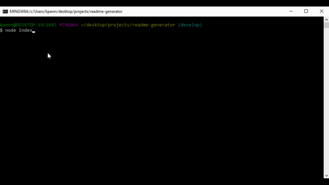

# Node.js Readme Generator

## Description
This is a command line package created using node.js/javascript that will create a readme file based on answers to prompts. It uses the inquirer dependency.

## Table of Contents
* [Installation](#Installation)
* [Usage](#Usage)
* [Technologies](#Technologies)
* [Preview](#Preview)

## Installation
After copying the repository run "npm i" to install the necessary dependencies.

## Usage
The program can be run from the command using node index.js.

Upon completion the created readme file will be placed in the output folder.

## Technologies
This progam was created using:

## Preview
Demo of the program
